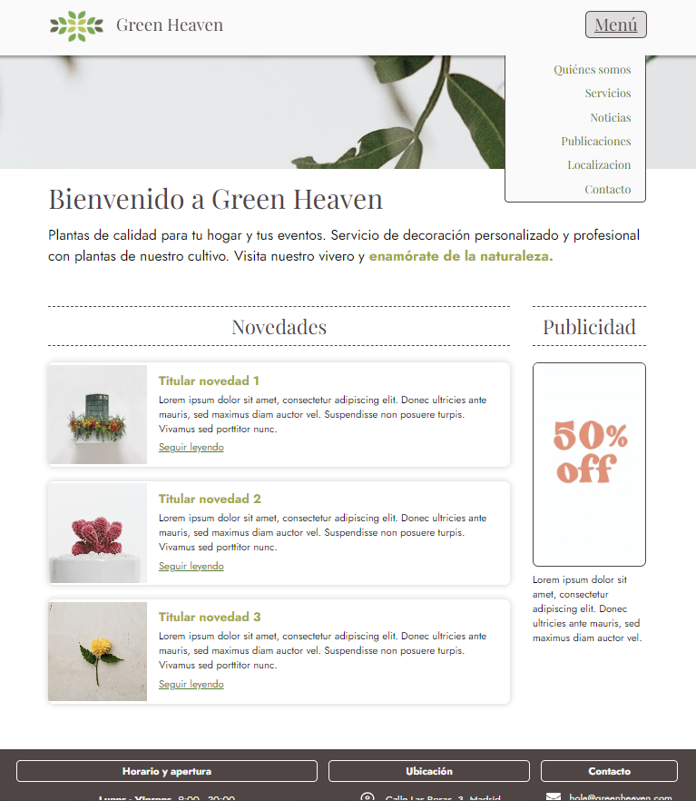
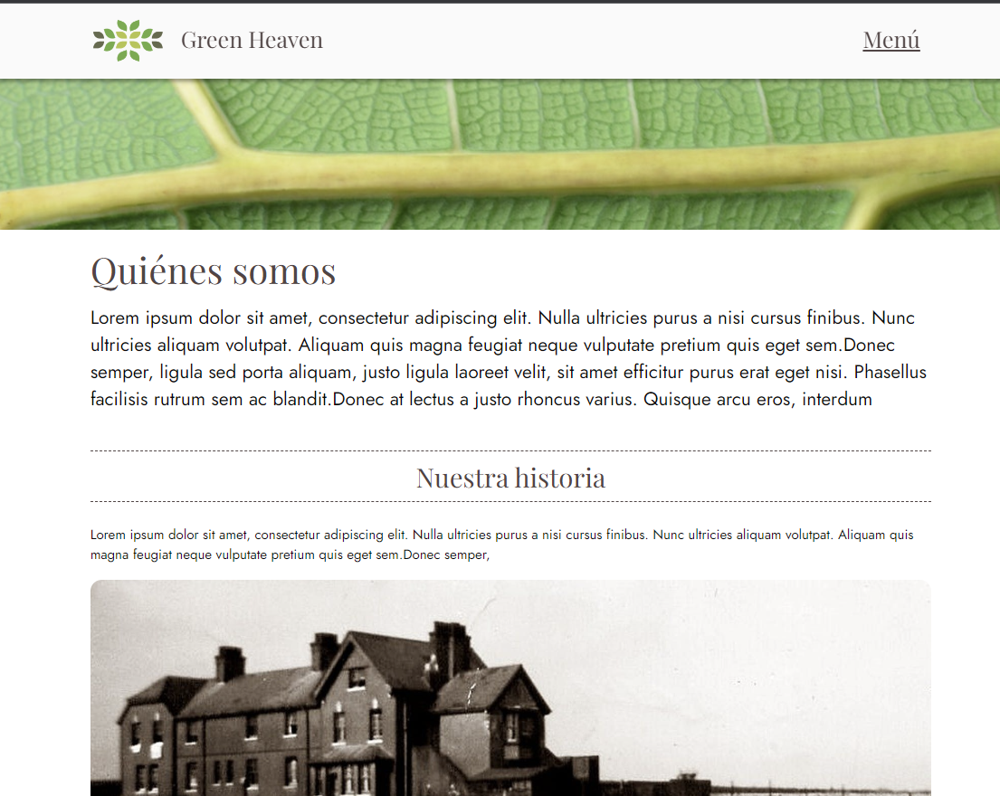
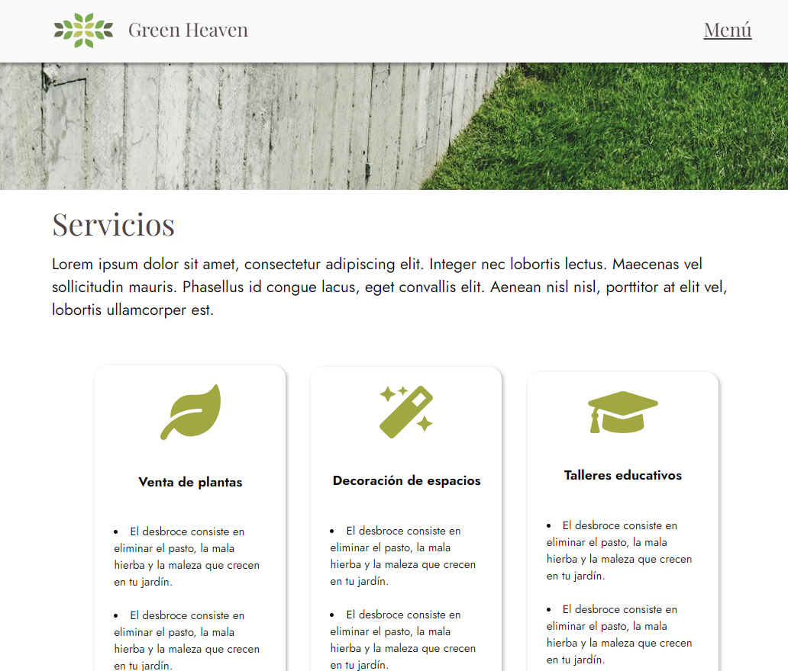
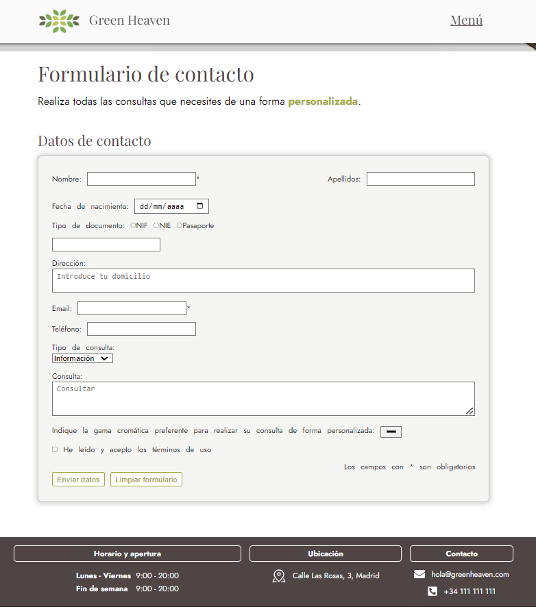

# Página web Green Heaven

En este repositorio nos encontramos con la creación de una página web usando
las tecnologías <b>HTML</b> y <b>CSS</b>.

Se desarrollaron las páginas:

<b>1. HOME</b>

En esta página nos encontramos con la cabecera fija en toda la web y un menú desplegable.
A parte, también encontramos diferentes contenedores con un diseño responsive.

<b>2. QUIENES SOMOS</b>

<b>3. SERVICIOS</b>

En esta página encontramos un diseño de varias columnas que, gracias a la propiedad flex de CSS,
conseguimos un diseño responsive a la hora de mover columnas para adaptarlo a las diferentes pantallas.

<b>4. CONTACTO</b>

Aquí nos encontramos con el formulario de contacto cuya estructura se realizó con HTML y se completó
el diseño con CSS.
También podemos observar el footer presente en todas las páginas desarrolladas.

